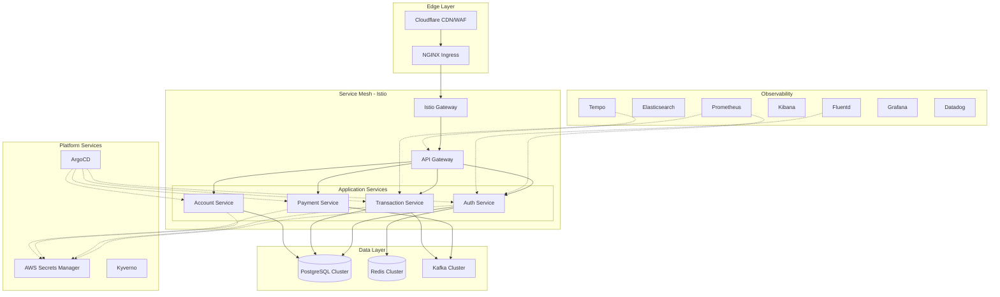

# Design Document: Production-Grade Fintech Platform

## Overview

This design document outlines the architecture for transforming a basic Kubernetes monorepo into a production-grade fintech platform infrastructure. The platform demonstrates enterprise-grade patterns for security, compliance, scalability, and operational excellence.

### Design Philosophy

The platform follows these core principles:

1. **Security by Default**: All components implement defense-in-depth with encryption, authentication, and authorization
2. **Infrastructure as Code**: All resources are declaratively defined and version-controlled
3. **GitOps-Driven**: ArgoCD manages all Kubernetes resources with automatic synchronization
4. **Observable by Design**: Comprehensive metrics, logs, and traces are built into every component
5. **Self-Service Platform**: Developers have tooling and guardrails to work independently
6. **Cost-Conscious**: Resource optimization and cost tracking are first-class concerns

### Technology Stack

**Core Infrastructure:**
- Kubernetes 1.28+ (EKS or GKE)
- Terraform for cloud resource provisioning
- Helm 3 for Kubernetes package management
- ArgoCD for GitOps continuous delivery

**Security & Networking:**
- Istio service mesh for mTLS and traffic management
- External Secrets Operator with AWS Secrets Manager
- Cert-Manager for TLS certificate automation
- Cloudflare for edge security and DDoS protection
- NGINX Ingress Controller

**Data Layer:**
- PostgreSQL 15 with Patroni for high availability
- Redis 7 cluster for caching and sessions
- Apache Kafka for event streaming

**Observability:**
- Prometheus for metrics collection
- Grafana for visualization and dashboards
- EFK Stack (Elasticsearch, Fluentd, Kibana) for log aggregation
- Tempo for distributed tracing
- Datadog for APM and unified observability

**CI/CD & Security:**
- GitHub Actions for CI/CD pipelines
- Trivy for container vulnerability scanning
- Kyverno for policy enforcement
- SonarQube for SAST
- OWASP ZAP for DAST

## Architecture

### High-Level Architecture



### Network Architecture

The platform implements a defense-in-depth network architecture:

**External Traffic Flow:**
1. Client requests hit Cloudflare edge (DDoS protection, WAF, rate limiting)
2. Traffic routes to NGINX Ingress Controller (TLS termination, L7 routing)
3. Istio Gateway receives traffic (mTLS initiation, observability injection)
4. API Gateway handles authentication, authorization, rate limiting
5. Backend services process requests within service mesh

**Internal Traffic Flow:**
- All service-to-service communication uses mTLS via Istio
- Network policies enforce zero-trust (deny-all by default)
- Services communicate through Kubernetes service discovery
- Egress traffic is controlled and monitored

### Multi-Environment Strategy

The platform maintains three isolated environments:


| Environment | Purpose | Cluster | Deployment Trigger | Data |
|-------------|---------|---------|-------------------|------|
| Development | Feature development, integration testing | dev-cluster | Auto on merge to main | Synthetic test data |
| Staging | Pre-production validation, load testing | staging-cluster | Manual approval | Anonymized production data |
| Production | Live customer traffic | prod-cluster | Manual approval | Real customer data |

**Environment Isolation:**
- Separate Kubernetes clusters per environment
- Separate VPCs with no cross-environment network connectivity
- Separate AWS Secrets Manager secrets per environment
- Separate observability stacks
- Environment-specific IAM roles and service accounts

**Promotion Strategy:**
- Container images are built once and promoted through environments
- Configuration is environment-specific via Helm values
- Database migrations are tested in dev/staging before production
- Feature flags enable gradual rollout in production

## Components and Interfaces

### 1. Secrets Management (External Secrets Operator + AWS Secrets Manager)

**Purpose:** Centralized secrets management with automatic injection into Kubernetes

**Components:**
- AWS Secrets Manager (fully managed service)
- External Secrets Operator (ESO) running in each cluster
- IAM Roles for Service Accounts (IRSA) for authentication

**Architecture:**
- AWS Secrets Manager stores all application secrets, API keys, and credentials
- External Secrets Operator syncs secrets from AWS Secrets Manager to Kubernetes
- IRSA grants ESO permissions to read secrets without static credentials
- Secrets are encrypted at rest using AWS KMS
- CloudTrail provides audit logging for all secret access

**Interfaces:**
```yaml
# SecretStore CRD - connects to AWS Secrets Manager
apiVersion: external-secrets.io/v1beta1
kind: SecretStore
metadata:
  name: aws-secretsmanager
  namespace: default
spec:
  provider:
    aws:
      service: SecretsManager
      region: us-east-1
      auth:
        jwt:
          serviceAccountRef:
            name: external-secrets-sa
```

```yaml
# ExternalSecret CRD - syncs specific secrets
apiVersion: external-secrets.io/v1beta1
kind: ExternalSecret
metadata:
  name: app-secrets
spec:
  refreshInterval: 1h
  secretStoreRef:
    name: aws-secretsmanager
    kind: SecretStore
  target:
    name: app-secrets
    creationPolicy: Owner
  data:
    - secretKey: database-password
      remoteRef:
        key: prod/database/credentials
        property: password
    - secretKey: api-key
      remoteRef:
        key: prod/external-api/credentials
        property: api_key
```

**Secret Rotation:**
- AWS Secrets Manager automatically rotates database credentials using Lambda functions
- Rotation schedule: every 90 days
- ESO detects changes via refreshInterval (1 hour) and updates Kubernetes secrets
- Pods are restarted automatically via Reloader controller to pick up new secrets

**IAM Configuration:**
```yaml
# IAM Role for External Secrets Operator
apiVersion: v1
kind: ServiceAccount
metadata:
  name: external-secrets-sa
  namespace: external-secrets
  annotations:
    eks.amazonaws.com/role-arn: arn:aws:iam::ACCOUNT_ID:role/external-secrets-role
```

**IAM Policy for ESO:**
```json
{
  "Version": "2012-10-17",
  "Statement": [
    {
      "Effect": "Allow",
      "Action": [
        "secretsmanager:GetSecretValue",
        "secretsmanager:DescribeSecret"
      ],
      "Resource": "arn:aws:secretsmanager:us-east-1:ACCOUNT_ID:secret:prod/*"
    }
  ]
}
```

**Audit Logging:**
- All secret access logged to AWS CloudTrail
- CloudTrail logs shipped to centralized logging (Elasticsearch via Fluentd)
- Alerts configured for suspicious access patterns
- CloudTrail logs are immutable and retained for compliance

**Secret Organization:**
```
AWS Secrets Manager Hierarchy:
├── dev/
│   ├── database/credentials
│   ├── redis/password
│   ├── kafka/credentials
│   └── external-api/keys
├── staging/
│   ├── database/credentials
│   ├── redis/password
│   └── ...
└── prod/
    ├── database/credentials
    ├── redis/password
    ├── kafka/credentials
    ├── external-api/keys
    └── payment-processor/credentials
```

**Advantages over HashiCorp Vault:**
- Fully managed service (no cluster to maintain)
- No unsealing required
- Native AWS integration with IRSA
- Built-in rotation with Lambda
- CloudTrail integration for audit logging
- Cost-effective for AWS deployments
- Automatic high availability and replication

### 2. Service Mesh (Istio)

**Purpose:** Secure service-to-service communication, traffic management, observability

**Components:**
- Istiod control plane (2 replicas for HA)
- Istio ingress gateway
- Istio egress gateway for controlled external access
- Envoy sidecars injected into all application pods

**mTLS Configuration:**
```yaml
apiVersion: security.istio.io/v1beta1
kind: PeerAuthentication
metadata:
  name: default
  namespace: istio-system
spec:
  mtls:
    mode: STRICT  # Enforce mTLS for all traffic
```

**Traffic Management:**
- Virtual Services for routing rules
- Destination Rules for load balancing, circuit breaking
- Service Entries for external service access
- Fault injection for chaos testing

**Observability Integration:**
- Automatic trace context propagation (W3C Trace Context)
- Metrics exported to Prometheus
- Access logs sent to Fluentd for Elasticsearch indexing
- Distributed traces sent to Tempo

### 3. API Gateway

**Purpose:** Single entry point for all external API traffic

**Implementation:** Kong Gateway or custom service using Envoy

**Capabilities:**
- JWT validation and authentication
- Rate limiting (per-client, per-endpoint, global)
- Request/response transformation
- API versioning and routing
- OpenAPI spec generation

**Rate Limiting Configuration:**
```yaml
apiVersion: networking.istio.io/v1alpha3
kind: EnvoyFilter
metadata:
  name: rate-limit-filter
spec:
  configPatches:
    - applyTo: HTTP_FILTER
      match:
        context: GATEWAY
      patch:
        operation: INSERT_BEFORE
        value:
          name: envoy.filters.http.ratelimit
          typed_config:
            "@type": type.googleapis.com/envoy.extensions.filters.http.ratelimit.v3.RateLimit
            domain: api-gateway
            rate_limit_service:
              grpc_service:
                envoy_grpc:
                  cluster_name: rate-limit-service
```

**Authentication Flow:**
1. Client sends request with JWT in Authorization header
2. API Gateway validates JWT signature and expiration
3. Gateway extracts claims and forwards as headers to backend
4. Backend services trust gateway-provided identity

### 4. Authentication Service

**Purpose:** OAuth2/OIDC provider for user and service authentication

**Implementation:** Keycloak or custom service

**Endpoints:**
- `POST /oauth/token` - Token issuance
- `POST /oauth/introspect` - Token validation
- `GET /.well-known/openid-configuration` - OIDC discovery
- `GET /oauth/jwks` - Public keys for JWT validation

**Token Structure:**
```json
{
  "sub": "user-123",
  "iss": "https://auth.platform.example.com",
  "aud": ["api-gateway"],
  "exp": 1234567890,
  "iat": 1234564290,
  "roles": ["user", "account-owner"],
  "scope": "read:account write:transaction"
}
```

**Database Schema:**
- Users table (id, email, password_hash, mfa_enabled)
- Sessions table (id, user_id, token_hash, expires_at)
- Roles table (id, name, permissions)
- User_Roles junction table

### 5. Database Infrastructure (PostgreSQL + Patroni)

**Purpose:** Highly available relational database for transactional data

**Architecture:**
- 3-node PostgreSQL cluster managed by Patroni
- Synchronous replication to 1 replica (quorum-based)
- Asynchronous replication to 2nd replica
- PgBouncer for connection pooling
- Automated failover (< 30 seconds)

**High Availability Setup:**
```yaml
# Patroni configuration
scope: postgres-cluster
namespace: /db/
name: postgres-1

restapi:
  listen: 0.0.0.0:8008
  connect_address: postgres-1:8008

etcd3:
  hosts: etcd-0:2379,etcd-1:2379,etcd-2:2379

bootstrap:
  dcs:
    ttl: 30
    loop_wait: 10
    retry_timeout: 10
    maximum_lag_on_failover: 1048576
    postgresql:
      use_pg_rewind: true
      parameters:
        max_connections: 500
        shared_buffers: 2GB
        effective_cache_size: 6GB
        wal_level: replica
        max_wal_senders: 10
        max_replication_slots: 10
```

**Backup Strategy:**
- Continuous WAL archiving to S3
- Full backups every 6 hours using pgBackRest
- Point-in-time recovery capability
- Backup retention: 30 days
- Automated backup verification

**Connection Pooling:**
- PgBouncer in transaction mode
- Pool size: 100 connections per database
- Max client connections: 1000

### 6. Caching Layer (Redis Cluster)

**Purpose:** Distributed cache for session data and frequently accessed information

**Architecture:**
- 6-node Redis cluster (3 masters, 3 replicas)
- Hash slot distribution for sharding
- Automatic failover via Redis Sentinel
- Persistence via AOF (Append-Only File)

**Configuration:**
```conf
# Redis cluster configuration
cluster-enabled yes
cluster-config-file nodes.conf
cluster-node-timeout 5000
appendonly yes
appendfsync everysec
maxmemory 4gb
maxmemory-policy allkeys-lru
```

**Use Cases:**
- Session storage (TTL: 24 hours)
- API response caching (TTL: 5 minutes)
- Rate limiting counters (TTL: 1 hour)
- Distributed locks for coordination

**Client Configuration:**
- Connection pooling (min: 10, max: 100)
- Automatic retry with exponential backoff
- Circuit breaker for failover scenarios

### 7. Event Streaming (Apache Kafka)

**Purpose:** Event-driven architecture for asynchronous communication

**Architecture:**
- 3-node Kafka cluster with Zookeeper
- Replication factor: 3
- Min in-sync replicas: 2
- Topic partitioning for parallelism

**Topics:**
- `transactions.created` - New transaction events
- `transactions.completed` - Completed transactions
- `accounts.updated` - Account state changes
- `payments.processed` - Payment processing events
- `audit.logs` - Immutable audit trail

**Producer Configuration:**
```properties
acks=all  # Wait for all replicas
retries=3
max.in.flight.requests.per.connection=1  # Maintain ordering
enable.idempotence=true  # Exactly-once semantics
compression.type=snappy
```

**Consumer Configuration:**
```properties
enable.auto.commit=false  # Manual commit for reliability
isolation.level=read_committed  # Only read committed messages
max.poll.records=100
session.timeout.ms=30000
```

**Schema Registry:**
- Confluent Schema Registry for Avro schemas
- Schema evolution with compatibility checks
- Centralized schema management

### 8. GitOps (ArgoCD)

**Purpose:** Declarative continuous delivery for Kubernetes resources

**Architecture:**
- ArgoCD server with HA (2 replicas)
- Redis for caching
- Dex for SSO integration
- Application Controller for sync operations

**Repository Structure:**
```
gitops/
├── apps/
│   ├── auth-service/
│   │   ├── base/
│   │   │   ├── deployment.yaml
│   │   │   ├── service.yaml
│   │   │   └── kustomization.yaml
│   │   └── overlays/
│   │       ├── dev/
│   │       ├── staging/
│   │       └── prod/
│   ├── transaction-service/
│   └── account-service/
├── infrastructure/
│   ├── istio/
│   ├── prometheus/
│   ├── external-secrets/
│   └── kyverno/
└── argocd/
    ├── applications/
    └── projects/
```

**Application Definition:**
```yaml
apiVersion: argoproj.io/v1alpha1
kind: Application
metadata:
  name: auth-service
  namespace: argocd
spec:
  project: platform
  source:
    repoURL: https://github.com/org/gitops-repo
    targetRevision: main
    path: apps/auth-service/overlays/prod
  destination:
    server: https://kubernetes.default.svc
    namespace: auth
  syncPolicy:
    automated:
      prune: true
      selfHeal: true
    syncOptions:
      - CreateNamespace=true
    retry:
      limit: 5
      backoff:
        duration: 5s
        factor: 2
        maxDuration: 3m
```

**Sync Strategy:**
- Automatic sync enabled for dev environment
- Manual sync required for staging and production
- Health checks before marking sync complete
- Rollback on failed health checks

### 9. Infrastructure as Code (Terraform)

**Purpose:** Provision and manage cloud resources declaratively

**Module Structure:**
```
terraform/
├── modules/
│   ├── vpc/
│   ├── eks/
│   ├── rds/
│   ├── elasticache/
│   ├── msk/  # Managed Kafka
│   ├── secrets-manager/
│   └── iam/
├── environments/
│   ├── dev/
│   │   ├── main.tf
│   │   ├── variables.tf
│   │   └── terraform.tfvars
│   ├── staging/
│   └── prod/
└── backend.tf
```

**State Management:**
- Remote state in S3 with DynamoDB locking
- Separate state files per environment
- State encryption at rest
- Versioning enabled for rollback

**Key Resources:**
- VPC with public/private subnets across 3 AZs
- EKS cluster with managed node groups
- RDS PostgreSQL with Multi-AZ
- ElastiCache Redis cluster
- MSK (Managed Kafka) cluster
- AWS Secrets Manager secrets with rotation
- S3 buckets for backups and artifacts
- IAM roles for service accounts (IRSA)
- KMS keys for encryption
- CloudTrail for audit logging
- Route53 for DNS management

### 10. CI/CD Pipeline (GitHub Actions)

**Purpose:** Automated build, test, and deployment pipeline

**Pipeline Stages:**


**1. Build Stage:**
```yaml
- name: Build and Test
  runs-on: ubuntu-latest
  steps:
    - uses: actions/checkout@v3
    - name: Run unit tests
      run: ./gradlew test  # For Java services
    - name: Build container image
      run: docker build -t $IMAGE_NAME:$SHA .
    - name: Scan image with Trivy
      run: trivy image --severity HIGH,CRITICAL $IMAGE_NAME:$SHA
    - name: Push to registry
      run: docker push $IMAGE_NAME:$SHA
```

**2. Security Scanning Stage:**
```yaml
- name: Security Scans
  steps:
    - name: SAST with SonarQube
      run: sonar-scanner
    - name: Dependency check
      run: ./gradlew dependencyCheckAnalyze
    - name: Secret scanning
      run: gitleaks detect
```

**3. Integration Test Stage:**
```yaml
- name: Integration Tests
  steps:
    - name: Deploy to test environment
      run: kubectl apply -f k8s/test/
    - name: Run integration tests
      run: ./gradlew integrationTest
    - name: DAST with OWASP ZAP
      run: zap-baseline.py -t http://test-api
```

**4. Deployment Stage:**
```yaml
- name: Deploy
  steps:
    - name: Update image tag in GitOps repo
      run: |
        cd gitops-repo
        kustomize edit set image $IMAGE_NAME:$SHA
        git commit -am "Update image to $SHA"
        git push
    - name: Wait for ArgoCD sync
      run: argocd app wait auth-service --timeout 300
```

**Progressive Delivery:**
- Canary deployment: 10% → 50% → 100%
- Automated rollback on error rate increase
- Smoke tests after each canary stage

### 11. Observability Stack

**Purpose:** Unified observability with metrics, logs, and traces

**Components:**

**Metrics (Prometheus + Grafana):**
- Prometheus for metrics collection (30s scrape interval)
- Thanos for long-term storage and multi-cluster queries
- Grafana for visualization
- AlertManager for alert routing

**Key Metrics:**
- RED metrics (Rate, Errors, Duration) for all services
- USE metrics (Utilization, Saturation, Errors) for infrastructure
- Business metrics (transactions/sec, revenue, user signups)
- SLI metrics for SLO tracking

**Logging (EFK Stack - Elasticsearch, Fluentd, Kibana):**
- Fluentd DaemonSet agents on each node for log collection
- Elasticsearch cluster for log storage and indexing
- Kibana for log visualization and analysis
- Structured JSON logging from all services
- Log retention: 30 days in hot storage, 90 days in warm storage

**Fluentd Configuration:**
```yaml
# Fluentd DaemonSet collects logs from all pods
apiVersion: v1
kind: ConfigMap
metadata:
  name: fluentd-config
data:
  fluent.conf: |
    <source>
      @type tail
      path /var/log/containers/*.log
      pos_file /var/log/fluentd-containers.log.pos
      tag kubernetes.*
      read_from_head true
      <parse>
        @type json
        time_format %Y-%m-%dT%H:%M:%S.%NZ
      </parse>
    </source>
    
    <filter kubernetes.**>
      @type kubernetes_metadata
      @id filter_kube_metadata
    </filter>
    
    <match kubernetes.**>
      @type elasticsearch
      host elasticsearch-master
      port 9200
      logstash_format true
      logstash_prefix kubernetes
      include_tag_key true
      type_name _doc
      <buffer>
        @type file
        path /var/log/fluentd-buffers/kubernetes.system.buffer
        flush_mode interval
        retry_type exponential_backoff
        flush_interval 5s
        retry_forever false
        retry_max_interval 30
        chunk_limit_size 2M
        queue_limit_length 8
        overflow_action block
      </buffer>
    </match>
```

**Elasticsearch Configuration:**
- 3-node Elasticsearch cluster for high availability
- Index lifecycle management (ILM) for automatic data tiering
- Hot tier: Recent logs (0-7 days) on fast SSD storage
- Warm tier: Older logs (7-30 days) on standard storage
- Cold tier: Archive logs (30-90 days) on S3 via snapshot
- Automated snapshots to S3 for disaster recovery

**Log Format:**
```json
{
  "timestamp": "2024-01-15T10:30:00Z",
  "level": "INFO",
  "service": "transaction-service",
  "trace_id": "abc123",
  "span_id": "def456",
  "message": "Transaction processed",
  "transaction_id": "txn-789",
  "amount": 100.00,
  "currency": "USD",
  "kubernetes": {
    "namespace": "default",
    "pod": "transaction-service-7d8f9c-abc123",
    "container": "transaction-service"
  }
}
```

**Kibana Dashboards:**
- Service-level log dashboards with filtering by namespace, pod, container
- Error rate dashboards with alerting
- Audit log dashboards for compliance
- Custom dashboards for business metrics
- Integration with Grafana for unified observability

**Tracing (Tempo):**
- OpenTelemetry instrumentation in all services
- Tempo for trace storage
- Automatic trace context propagation via Istio
- Trace retention: 14 days

**APM (Datadog):**
- Unified view across metrics, logs, traces
- Application performance monitoring
- Real user monitoring (RUM)
- Synthetic monitoring for critical endpoints
- Custom dashboards and alerts

**Alerting Strategy:**
```yaml
# Example Prometheus alert
groups:
  - name: slo-alerts
    rules:
      - alert: HighErrorRate
        expr: |
          sum(rate(http_requests_total{status=~"5.."}[5m])) 
          / sum(rate(http_requests_total[5m])) > 0.01
        for: 5m
        labels:
          severity: critical
        annotations:
          summary: "Error rate above 1% for 5 minutes"
          runbook: "https://runbooks.example.com/high-error-rate"
```

### 12. Policy Enforcement (Kyverno)

**Purpose:** Automated policy enforcement for security and compliance

**Policy Categories:**

**1. Security Policies:**
```yaml
apiVersion: kyverno.io/v1
kind: ClusterPolicy
metadata:
  name: require-non-root
spec:
  validationFailureAction: enforce
  rules:
    - name: check-runAsNonRoot
      match:
        resources:
          kinds:
            - Pod
      validate:
        message: "Containers must run as non-root"
        pattern:
          spec:
            securityContext:
              runAsNonRoot: true
```

**2. Resource Policies:**
```yaml
apiVersion: kyverno.io/v1
kind: ClusterPolicy
metadata:
  name: require-resource-limits
spec:
  validationFailureAction: enforce
  rules:
    - name: check-resource-limits
      match:
        resources:
          kinds:
            - Pod
      validate:
        message: "Containers must have resource limits"
        pattern:
          spec:
            containers:
              - resources:
                  limits:
                    memory: "?*"
                    cpu: "?*"
```

**3. Image Policies:**
```yaml
apiVersion: kyverno.io/v1
kind: ClusterPolicy
metadata:
  name: require-image-signature
spec:
  validationFailureAction: enforce
  rules:
    - name: verify-signature
      match:
        resources:
          kinds:
            - Pod
      verifyImages:
        - imageReferences:
            - "registry.example.com/*"
          attestors:
            - count: 1
              entries:
                - keys:
                    publicKeys: |-
                      -----BEGIN PUBLIC KEY-----
                      ...
                      -----END PUBLIC KEY-----
```

**4. Compliance Policies:**
- Require labels for cost allocation
- Enforce network policies
- Require pod disruption budgets for production
- Enforce backup annotations

### 13. Auto-Scaling Infrastructure

**Purpose:** Automatic scaling based on demand

**Horizontal Pod Autoscaler (HPA):**
```yaml
apiVersion: autoscaling/v2
kind: HorizontalPodAutoscaler
metadata:
  name: auth-service-hpa
spec:
  scaleTargetRef:
    apiVersion: apps/v1
    kind: Deployment
    name: auth-service
  minReplicas: 3
  maxReplicas: 20
  metrics:
    - type: Resource
      resource:
        name: cpu
        target:
          type: Utilization
          averageUtilization: 70
    - type: Resource
      resource:
        name: memory
        target:
          type: Utilization
          averageUtilization: 80
    - type: Pods
      pods:
        metric:
          name: http_requests_per_second
        target:
          type: AverageValue
          averageValue: "1000"
  behavior:
    scaleDown:
      stabilizationWindowSeconds: 300
      policies:
        - type: Percent
          value: 50
          periodSeconds: 60
    scaleUp:
      stabilizationWindowSeconds: 0
      policies:
        - type: Percent
          value: 100
          periodSeconds: 30
```

**Vertical Pod Autoscaler (VPA):**
```yaml
apiVersion: autoscaling.k8s.io/v1
kind: VerticalPodAutoscaler
metadata:
  name: transaction-service-vpa
spec:
  targetRef:
    apiVersion: apps/v1
    kind: Deployment
    name: transaction-service
  updatePolicy:
    updateMode: "Auto"
  resourcePolicy:
    containerPolicies:
      - containerName: "*"
        minAllowed:
          cpu: 100m
          memory: 128Mi
        maxAllowed:
          cpu: 2
          memory: 4Gi
```

**Cluster Autoscaler:**
- Automatically adds nodes when pods can't be scheduled
- Removes underutilized nodes after 10 minutes
- Respects pod disruption budgets
- Node group configuration:
  - Min nodes: 3
  - Max nodes: 20
  - Instance types: mixed (spot + on-demand)

### 14. Disaster Recovery Infrastructure

**Purpose:** Ensure business continuity during catastrophic failures

**Backup Strategy:**

**Database Backups:**
- Continuous WAL archiving to S3 (cross-region replication)
- Full backups every 6 hours
- Automated backup verification
- Point-in-time recovery capability
- Backup retention: 30 days

**Kubernetes Backups:**
- Velero for cluster backup
- Daily backups of all namespaces
- Backup includes PVCs and cluster resources
- Stored in S3 with cross-region replication

**Configuration Backups:**
- GitOps repository is source of truth
- All configuration in version control
- Automated Git backups to secondary location

**Recovery Procedures:**

**RTO/RPO Targets:**
- Database: RTO 1 hour, RPO 5 minutes
- Application services: RTO 30 minutes, RPO 0 (stateless)
- Configuration: RTO 15 minutes, RPO 0 (Git-based)

**Disaster Scenarios:**
1. **Single node failure**: Automatic failover (< 1 minute)
2. **Availability zone failure**: Automatic redistribution (< 5 minutes)
3. **Region failure**: Manual failover to DR region (< 1 hour)
4. **Data corruption**: Point-in-time recovery from backups

**DR Testing:**
- Monthly DR drills
- Automated recovery testing in staging
- Documented runbooks for each scenario

### 15. Developer Experience Tooling

**Purpose:** Enable productive local development

**Local Development (Tilt):**

**Tiltfile:**
```python
# Load Kubernetes manifests
k8s_yaml(kustomize('k8s/dev'))

# Build and deploy services
docker_build('auth-service', './services/auth',
  live_update=[
    sync('./services/auth/src', '/app/src'),
    run('gradle compileJava', trigger='./services/auth/src')
  ])

# Port forwards for local access
k8s_resource('auth-service',
  port_forwards='8080:8080',
  resource_deps=['postgres', 'redis'])

# Local dependencies
docker_compose('./docker-compose.dev.yml')
```

**Local Infrastructure:**
```yaml
# docker-compose.dev.yml
version: '3.8'
services:
  postgres:
    image: postgres:15
    environment:
      POSTGRES_PASSWORD: dev
    ports:
      - "5432:5432"
  
  redis:
    image: redis:7
    ports:
      - "6379:6379"
  
  kafka:
    image: confluentinc/cp-kafka:7.5.0
    environment:
      KAFKA_ZOOKEEPER_CONNECT: zookeeper:2181
    ports:
      - "9092:9092"
```

**Hot Reloading:**
- Java services: Spring DevTools
- Node services: nodemon
- Changes reflected in < 30 seconds

**Service Templates:**
```bash
# CLI tool for scaffolding new services
platform-cli create service \
  --name payment-service \
  --type java-spring-boot \
  --database postgres \
  --messaging kafka
```

**Generated Structure:**
```
payment-service/
├── src/
├── Dockerfile
├── k8s/
│   ├── base/
│   └── overlays/
├── .github/
│   └── workflows/
│       └── ci.yml
└── README.md
```

## Data Models

### Authentication Service

**Users Table:**
```sql
CREATE TABLE users (
  id UUID PRIMARY KEY DEFAULT gen_random_uuid(),
  email VARCHAR(255) UNIQUE NOT NULL,
  password_hash VARCHAR(255) NOT NULL,
  mfa_enabled BOOLEAN DEFAULT FALSE,
  mfa_secret VARCHAR(255),
  created_at TIMESTAMP DEFAULT NOW(),
  updated_at TIMESTAMP DEFAULT NOW(),
  last_login_at TIMESTAMP,
  status VARCHAR(50) DEFAULT 'active',
  CONSTRAINT email_format CHECK (email ~* '^[A-Za-z0-9._%+-]+@[A-Za-z0-9.-]+\.[A-Z|a-z]{2,}$')
);

CREATE INDEX idx_users_email ON users(email);
CREATE INDEX idx_users_status ON users(status);
```

**Sessions Table:**
```sql
CREATE TABLE sessions (
  id UUID PRIMARY KEY DEFAULT gen_random_uuid(),
  user_id UUID NOT NULL REFERENCES users(id) ON DELETE CASCADE,
  token_hash VARCHAR(255) NOT NULL,
  expires_at TIMESTAMP NOT NULL,
  created_at TIMESTAMP DEFAULT NOW(),
  ip_address INET,
  user_agent TEXT,
  CONSTRAINT valid_expiry CHECK (expires_at > created_at)
);

CREATE INDEX idx_sessions_user_id ON sessions(user_id);
CREATE INDEX idx_sessions_token_hash ON sessions(token_hash);
CREATE INDEX idx_sessions_expires_at ON sessions(expires_at);
```

**Roles and Permissions:**
```sql
CREATE TABLE roles (
  id UUID PRIMARY KEY DEFAULT gen_random_uuid(),
  name VARCHAR(100) UNIQUE NOT NULL,
  description TEXT,
  created_at TIMESTAMP DEFAULT NOW()
);

CREATE TABLE permissions (
  id UUID PRIMARY KEY DEFAULT gen_random_uuid(),
  resource VARCHAR(100) NOT NULL,
  action VARCHAR(50) NOT NULL,
  description TEXT,
  UNIQUE(resource, action)
);

CREATE TABLE role_permissions (
  role_id UUID REFERENCES roles(id) ON DELETE CASCADE,
  permission_id UUID REFERENCES permissions(id) ON DELETE CASCADE,
  PRIMARY KEY (role_id, permission_id)
);

CREATE TABLE user_roles (
  user_id UUID REFERENCES users(id) ON DELETE CASCADE,
  role_id UUID REFERENCES roles(id) ON DELETE CASCADE,
  granted_at TIMESTAMP DEFAULT NOW(),
  granted_by UUID REFERENCES users(id),
  PRIMARY KEY (user_id, role_id)
);
```

### Transaction Service

**Transactions Table:**
```sql
CREATE TABLE transactions (
  id UUID PRIMARY KEY DEFAULT gen_random_uuid(),
  account_id UUID NOT NULL,
  type VARCHAR(50) NOT NULL,
  amount DECIMAL(19, 4) NOT NULL,
  currency VARCHAR(3) NOT NULL,
  status VARCHAR(50) NOT NULL DEFAULT 'pending',
  description TEXT,
  metadata JSONB,
  idempotency_key VARCHAR(255) UNIQUE NOT NULL,
  created_at TIMESTAMP DEFAULT NOW(),
  updated_at TIMESTAMP DEFAULT NOW(),
  completed_at TIMESTAMP,
  CONSTRAINT positive_amount CHECK (amount > 0),
  CONSTRAINT valid_status CHECK (status IN ('pending', 'processing', 'completed', 'failed', 'cancelled'))
);

CREATE INDEX idx_transactions_account_id ON transactions(account_id);
CREATE INDEX idx_transactions_status ON transactions(status);
CREATE INDEX idx_transactions_created_at ON transactions(created_at DESC);
CREATE INDEX idx_transactions_idempotency_key ON transactions(idempotency_key);
```

**Transaction Events (Audit Log):**
```sql
CREATE TABLE transaction_events (
  id BIGSERIAL PRIMARY KEY,
  transaction_id UUID NOT NULL REFERENCES transactions(id),
  event_type VARCHAR(50) NOT NULL,
  old_status VARCHAR(50),
  new_status VARCHAR(50),
  metadata JSONB,
  created_at TIMESTAMP DEFAULT NOW(),
  created_by VARCHAR(255)
);

CREATE INDEX idx_transaction_events_transaction_id ON transaction_events(transaction_id);
CREATE INDEX idx_transaction_events_created_at ON transaction_events(created_at DESC);

-- Make audit log immutable
CREATE RULE transaction_events_no_update AS ON UPDATE TO transaction_events DO INSTEAD NOTHING;
CREATE RULE transaction_events_no_delete AS ON DELETE TO transaction_events DO INSTEAD NOTHING;
```

### Account Service

**Accounts Table:**
```sql
CREATE TABLE accounts (
  id UUID PRIMARY KEY DEFAULT gen_random_uuid(),
  user_id UUID NOT NULL,
  account_number VARCHAR(50) UNIQUE NOT NULL,
  account_type VARCHAR(50) NOT NULL,
  balance DECIMAL(19, 4) NOT NULL DEFAULT 0,
  currency VARCHAR(3) NOT NULL DEFAULT 'USD',
  status VARCHAR(50) NOT NULL DEFAULT 'active',
  created_at TIMESTAMP DEFAULT NOW(),
  updated_at TIMESTAMP DEFAULT NOW(),
  CONSTRAINT valid_balance CHECK (balance >= 0),
  CONSTRAINT valid_status CHECK (status IN ('active', 'suspended', 'closed'))
);

CREATE INDEX idx_accounts_user_id ON accounts(user_id);
CREATE INDEX idx_accounts_account_number ON accounts(account_number);
CREATE INDEX idx_accounts_status ON accounts(status);
```

### Event Schemas (Kafka/Avro)

**Transaction Created Event:**
```json
{
  "namespace": "com.platform.events",
  "type": "record",
  "name": "TransactionCreated",
  "fields": [
    {"name": "transaction_id", "type": "string"},
    {"name": "account_id", "type": "string"},
    {"name": "amount", "type": "string"},
    {"name": "currency", "type": "string"},
    {"name": "type", "type": "string"},
    {"name": "idempotency_key", "type": "string"},
    {"name": "created_at", "type": "long", "logicalType": "timestamp-millis"},
    {"name": "metadata", "type": ["null", "string"], "default": null}
  ]
}
```

## Correctness Properties


*A property is a characteristic or behavior that should hold true across all valid executions of a system—essentially, a formal statement about what the system should do. Properties serve as the bridge between human-readable specifications and machine-verifiable correctness guarantees.*

### Acceptance Criteria Testability Analysis

Given the infrastructure-focused nature of this platform, many requirements involve configuration and deployment rather than runtime behavior. Below is the analysis of which acceptance criteria are testable as properties, examples, or not testable through automated tests:

**Requirement 1 (Secrets Management):**
- 1.1: Configuration requirement (not testable via code)
- 1.2: Configuration requirement (not testable via code)
- 1.3: Configuration verification (edge case - verify encryption is enabled)
- 1.4: Configuration verification (edge case - verify TLS version)
- 1.5: Infrastructure behavior (testable as integration test example)
- 1.6: Infrastructure behavior (testable as property - audit logs exist for all access)

**Requirement 2 (Network Security):**
- 2.1: Configuration verification (edge case - verify mTLS is enforced)
- 2.2: Configuration verification (edge case - verify deny-all default)
- 2.3: Infrastructure behavior (testable as property - unauthorized connections are blocked)
- 2.4: Configuration verification (edge case - verify TLS termination)
- 2.5: Configuration requirement (not testable via code)
- 2.6: Configuration requirement (not testable via code)

**Requirement 3 (Authentication):**
- 3.1-3.7: These are infrastructure setup requirements, but the Auth Service itself has testable properties

**Requirement 4 (Transaction Processing):**
- 4.1: Configuration verification (ACID support exists)
- 4.2: Configuration verification (tracing is enabled)
- 4.3: Configuration verification (message queue configured)
- 4.4: Testable as property - idempotency works correctly
- 4.5: Infrastructure pattern (not directly testable)
- 4.6: Testable as property - message ordering is maintained
- 4.7: Testable as property - audit logs are immutable and complete

**Requirement 5 (High Availability Database):**
- 5.1: Configuration verification (3 replicas exist)
- 5.2: Testable as example - failover completes within 30s
- 5.3: Configuration verification (sync replication enabled)
- 5.4-5.7: Operational procedures (tested via runbooks, not code)

**Requirement 6 (Caching):**
- 6.1: Performance requirement (not unit testable)
- 6.2-6.3: Configuration and operational behavior
- 6.4: Testable as property - TTL expiration works correctly
- 6.5: Testable as property - expired entries are evicted
- 6.6: Testable as property - distributed locks work correctly

**Requirement 7 (Event-Driven Architecture):**
- 7.1: Testable as property - at-least-once delivery guarantee
- 7.2: Testable as property - persistence before acknowledgment
- 7.3: Configuration verification (consumer groups exist)
- 7.4: Testable as property - retry with exponential backoff
- 7.5: Testable as property - message ordering within partition
- 7.6: Testable as property - dead letter queue receives failed messages

**Requirement 8 (Infrastructure as Code):**
- 8.1-8.7: These are about IaC tooling and processes, tested via CI/CD validation

**Requirement 9 (CI/CD Pipeline):**
- 9.1-9.7: Pipeline configuration, tested by running the pipeline itself

**Requirement 10 (Observability):**
- 10.1-10.7: Infrastructure configuration, verified by checking metrics/logs exist

**Requirement 11 (Auto-Scaling):**
- 11.1-11.7: Configuration verification and operational behavior

**Requirement 12 (API Gateway):**
- 12.1: Testable as property - routing works correctly for all paths
- 12.2: Testable as property - rate limiting enforces limits
- 12.3: Testable as property - request size limits are enforced
- 12.4: Testable as property - invalid requests are rejected
- 12.5: Testable as example - transformation works correctly
- 12.6: Configuration verification (OpenAPI spec exists)
- 12.7: Testable as property - all requests generate logs with correlation IDs

**Requirement 13 (Disaster Recovery):**
- 13.1-13.7: Operational procedures, tested via DR drills

**Requirement 14 (Compliance and Policy):**
- 14.1-14.5: Testable as properties - policies block violations
- 14.6-14.7: Reporting and audit requirements

**Requirement 15 (Developer Experience):**
- 15.1-15.7: Tooling and documentation requirements

**Requirement 16 (Cost Management):**
- 16.1-16.7: Operational and reporting requirements

**Requirement 17 (Multi-Environment):**
- 17.1-17.7: Infrastructure configuration requirements

**Requirement 18 (Chaos Engineering):**
- 18.1-18.2: Tooling requirements
- 18.3: Testable as property - circuit breakers open on failures
- 18.4: Testable as property - retries use exponential backoff
- 18.5-18.7: Infrastructure patterns

**Requirement 19 (Payment Processing):**
- 19.1-19.7: Infrastructure patterns and configuration

**Requirement 20 (Monitoring and Alerting):**
- 20.1-20.7: Observability configuration

### Property Reflection

After analyzing all acceptance criteria, the testable properties fall into these categories:

1. **Infrastructure Behavior Properties**: Audit logging, rate limiting, request validation, policy enforcement
2. **Data Integrity Properties**: Idempotency, message ordering, immutable audit logs
3. **Resilience Properties**: Circuit breakers, retry logic, distributed locks, cache expiration
4. **Security Properties**: Unauthorized access blocking, request rejection

Many requirements are about infrastructure configuration rather than runtime behavior. For a platform engineering project, the "tests" are often:
- Infrastructure validation scripts
- Policy-as-code enforcement
- CI/CD pipeline checks
- Operational runbooks and DR drills

The properties below focus on the testable runtime behaviors of the platform services.

### Core Platform Properties

**Property 1: Audit Log Completeness**
*For any* secret access operation, the system SHALL create an immutable audit log entry containing the accessor identity, timestamp, and secret identifier.
**Validates: Requirements 1.6, 4.7**

**Property 2: Unauthorized Access Blocking**
*For any* network connection attempt that violates network policies, the Service Mesh SHALL block the connection and create a log entry.
**Validates: Requirements 2.3**

**Property 3: Idempotency Key Enforcement**
*For any* transaction with an idempotency key, submitting the same key multiple times SHALL return the same result without creating duplicate transactions.
**Validates: Requirements 4.4, 19.7**

**Property 4: Message Ordering Preservation**
*For any* sequence of events published to the same Kafka partition, consumers SHALL receive the events in the same order they were published.
**Validates: Requirements 4.6, 7.5**

**Property 5: At-Least-Once Delivery**
*For any* event published to the Event Bus, the system SHALL deliver the event to all subscribed consumers at least once, even in the presence of consumer failures.
**Validates: Requirements 7.1**

**Property 6: Persistence Before Acknowledgment**
*For any* event published to the Event Bus, the system SHALL persist the event to durable storage before sending an acknowledgment to the publisher.
**Validates: Requirements 7.2**

**Property 7: Exponential Backoff Retry**
*For any* failed message processing attempt, the Event Bus SHALL retry delivery with exponentially increasing delays between attempts.
**Validates: Requirements 7.4, 18.4**

**Property 8: Dead Letter Queue Routing**
*For any* message that exceeds the maximum retry limit, the Event Bus SHALL route the message to a dead letter queue without further delivery attempts.
**Validates: Requirements 7.6**

**Property 9: Cache TTL Expiration**
*For any* cache entry with a TTL, the Cache Layer SHALL automatically evict the entry after the TTL expires and return cache miss for subsequent reads.
**Validates: Requirements 6.4, 6.5**

**Property 10: Distributed Lock Exclusivity**
*For any* distributed lock acquisition attempt, the Cache Layer SHALL grant the lock to at most one client at a time.
**Validates: Requirements 6.6**

**Property 11: API Gateway Rate Limiting**
*For any* client making requests to a rate-limited endpoint, the API Gateway SHALL reject requests that exceed the configured rate limit with HTTP 429 status.
**Validates: Requirements 12.2**

**Property 12: Request Size Limit Enforcement**
*For any* request exceeding the configured size limit, the API Gateway SHALL reject the request before forwarding to backend services.
**Validates: Requirements 12.3**

**Property 13: Schema Validation**
*For any* request with an invalid schema, the API Gateway SHALL reject the request and return a validation error before reaching backend services.
**Validates: Requirements 12.4**

**Property 14: Correlation ID Propagation**
*For any* request processed by the API Gateway, the system SHALL generate or propagate a correlation ID and include it in all logs and traces for that request.
**Validates: Requirements 12.7**

**Property 15: Policy Violation Blocking**
*For any* Kubernetes resource that violates a Kyverno policy, the Policy Engine SHALL block the resource creation and log the violation.
**Validates: Requirements 14.1, 14.2, 14.3, 14.4, 14.5**

**Property 16: Circuit Breaker State Transitions**
*For any* external service integration with a circuit breaker, when the failure rate exceeds the threshold, the circuit breaker SHALL transition to open state and reject requests without calling the external service.
**Validates: Requirements 18.3**

**Property 17: JWT Token Validation**
*For any* request with an invalid, expired, or malformed JWT token, the API Gateway SHALL reject the request with HTTP 401 status before forwarding to backend services.
**Validates: Requirements 3.2, 3.3**

**Property 18: Database Failover Completion**
*For any* primary database node failure, the Database Cluster SHALL complete failover and restore write availability within 30 seconds.
**Validates: Requirements 5.2**
*Note: This is a time-bounded property that requires integration testing rather than unit testing.*

**Property 19: Backup Integrity Verification**
*For any* completed backup operation, the Platform SHALL verify the backup integrity by performing a test restore before marking the backup as valid.
**Validates: Requirements 13.4**
*Note: This is an operational property tested through backup procedures.*

**Property 20: Immutable Audit Log**
*For any* audit log entry, once written, the entry SHALL be immutable and any attempt to modify or delete it SHALL be prevented.
**Validates: Requirements 4.7**

## Error Handling

### Error Categories

**1. Infrastructure Errors:**
- Node failures → Automatic failover and rescheduling
- Network partitions → Circuit breakers and retries
- Resource exhaustion → Load shedding and backpressure

**2. Application Errors:**
- Invalid requests → Validation at API gateway, return 400
- Authentication failures → Return 401 with error details
- Authorization failures → Return 403 with minimal information
- Resource not found → Return 404
- Rate limit exceeded → Return 429 with retry-after header
- Server errors → Return 500, log details, alert on-call

**3. Data Errors:**
- Database connection failures → Retry with exponential backoff, circuit breaker
- Transaction conflicts → Retry with jitter
- Data corruption → Restore from backup, alert immediately

**4. External Service Errors:**
- Payment processor timeout → Circuit breaker, return error to client
- Third-party API failures → Fallback responses, queue for retry

### Error Response Format

```json
{
  "error": {
    "code": "RATE_LIMIT_EXCEEDED",
    "message": "Too many requests",
    "details": "Rate limit of 100 requests per minute exceeded",
    "trace_id": "abc123def456",
    "timestamp": "2024-01-15T10:30:00Z",
    "retry_after": 60
  }
}
```

### Circuit Breaker Configuration

```yaml
circuitBreaker:
  failureThreshold: 5  # Open after 5 failures
  successThreshold: 2  # Close after 2 successes
  timeout: 30s  # Try again after 30s in open state
  halfOpenRequests: 3  # Allow 3 requests in half-open state
```

### Retry Strategy

```yaml
retry:
  maxAttempts: 3
  initialDelay: 100ms
  maxDelay: 10s
  multiplier: 2
  jitter: 0.1  # Add 10% random jitter
  retryableErrors:
    - UNAVAILABLE
    - DEADLINE_EXCEEDED
    - RESOURCE_EXHAUSTED
```

## Testing Strategy

### Testing Approach

This platform requires a multi-layered testing strategy appropriate for infrastructure and platform engineering:

**1. Infrastructure Validation Tests:**
- Terraform plan validation in CI
- Helm chart linting and dry-run
- Kyverno policy validation
- Network policy testing with tools like Cilium Network Policy Editor

**2. Integration Tests:**
- End-to-end tests for critical paths (authentication, transaction processing)
- Service mesh behavior tests (mTLS, circuit breakers, retries)
- Database failover tests
- Backup and restore procedures

**3. Property-Based Tests:**
- For testable runtime behaviors (idempotency, rate limiting, message ordering)
- Minimum 100 iterations per property test
- Each test tagged with: **Feature: production-fintech-platform, Property N: [property text]**

**4. Chaos Engineering:**
- Regular chaos experiments in staging
- Pod deletion, network latency injection, resource exhaustion
- Validate circuit breakers, retries, and failover mechanisms

**5. Security Testing:**
- Container vulnerability scanning (Trivy)
- SAST with SonarQube
- DAST with OWASP ZAP
- Penetration testing quarterly

**6. Performance Testing:**
- Load testing with k6 or Gatling
- Database performance benchmarks
- Cache hit rate analysis
- API latency percentiles (p50, p95, p99)

**7. Compliance Testing:**
- Policy enforcement validation
- Audit log completeness checks
- Encryption verification
- Access control testing

### Property-Based Testing Configuration

**Library Selection:**
- Java services: jqwik or QuickCheck for Java
- Node services: fast-check
- Python services: Hypothesis

**Test Configuration:**
```java
@Property
@Tag("Feature: production-fintech-platform, Property 3: Idempotency Key Enforcement")
void idempotencyKeyPreventsduplicateTransactions(
    @ForAll("transactions") Transaction txn) {
    
    // Submit transaction twice with same idempotency key
    Response first = transactionService.submit(txn);
    Response second = transactionService.submit(txn);
    
    // Both should return same transaction ID
    assertEquals(first.getTransactionId(), second.getTransactionId());
    
    // Only one transaction should exist in database
    assertEquals(1, transactionRepository.countByIdempotencyKey(txn.getIdempotencyKey()));
}
```

**Minimum Test Iterations:** 100 per property test

### Testing Matrix

| Component | Unit Tests | Integration Tests | Property Tests | Chaos Tests |
|-----------|------------|-------------------|----------------|-------------|
| Auth Service | ✓ | ✓ | ✓ | - |
| Transaction Service | ✓ | ✓ | ✓ | ✓ |
| API Gateway | ✓ | ✓ | ✓ | ✓ |
| Database Cluster | - | ✓ | - | ✓ |
| Cache Layer | - | ✓ | ✓ | ✓ |
| Event Bus | - | ✓ | ✓ | ✓ |
| Service Mesh | - | ✓ | - | ✓ |
| Policy Engine | - | ✓ | ✓ | - |

### CI/CD Testing Gates

**Pull Request:**
- Unit tests must pass
- SAST scan must pass
- Container image scan (no critical vulnerabilities)
- Terraform validation

**Dev Deployment:**
- Integration tests must pass
- Smoke tests must pass

**Staging Deployment:**
- Full end-to-end test suite
- Performance tests
- DAST scan
- Manual QA approval

**Production Deployment:**
- Canary deployment with automated rollback
- Synthetic monitoring validation
- Manual approval from platform team

